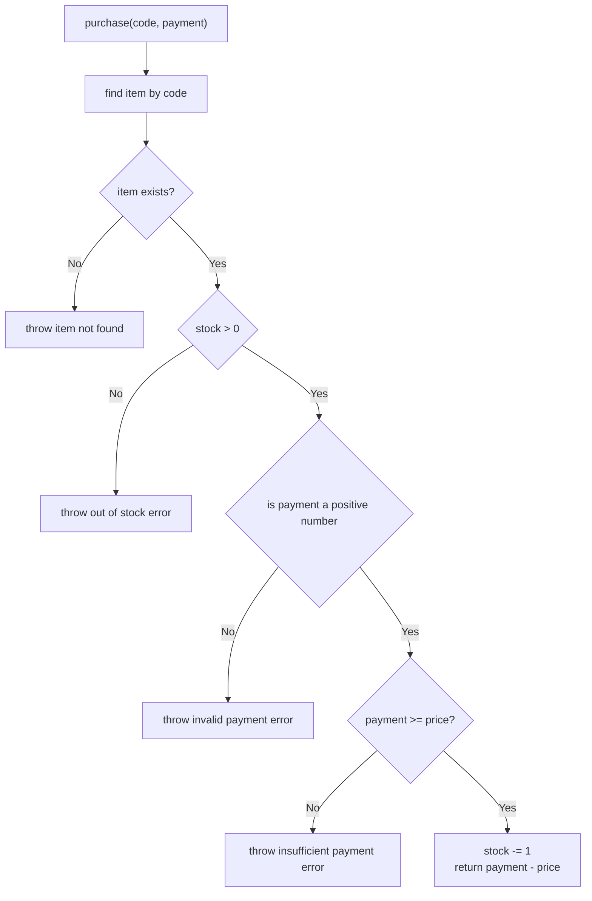
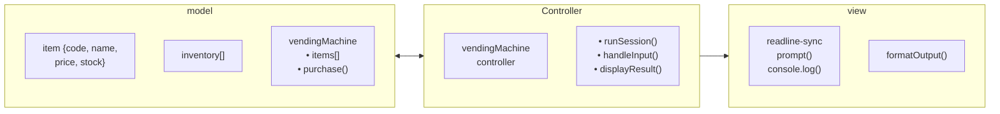
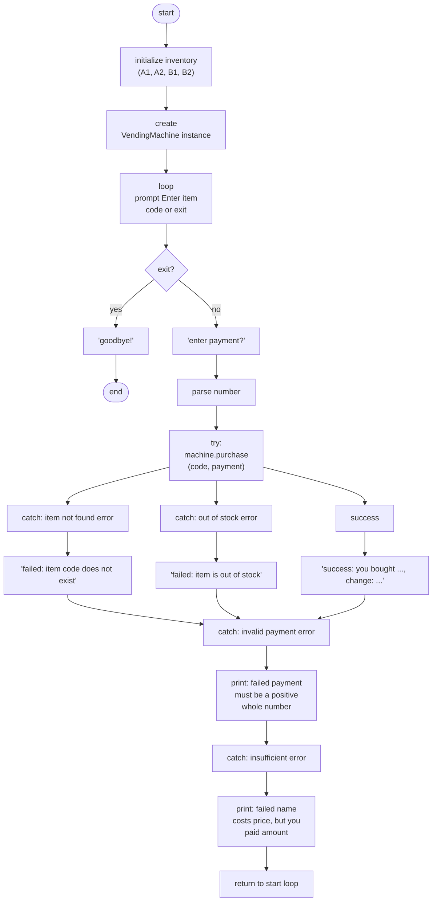

```mermaid
flowchart TD
    A["purchase(code, payment)"] --> B["find item by code"]
    B --> C{"item exists?"}
    
    C -- No --> D["throw item not found"]
    C -- Yes --> E{"stock > 0"}
    
    E -- No --> F["throw out of stock error"]
    E -- Yes --> G{"is payment a positive number"}
    
    G -- No --> H["throw invalid payment error"]
    G -- Yes --> I{"payment >= price?"}
    
    I -- No --> J["throw insufficient payment error"]
    I -- Yes --> K["stock -= 1 <br/> return payment - price"]

```

```mermaid
flowchart LR
    subgraph Model ["model"]
        direction TB
        M1["item {code, name,<br/>price, stock}"]
        M2["inventory[]"]
        M3["vendingMachine<br/>• items[]<br/>• purchase()"]
    end

    subgraph Controller ["Controller"]
        direction TB
        C1["vendingMachine<br/>controller"]
        C2["• runSession()<br/>• handleInput()<br/>• displayResult()"]
    end

    subgraph View ["view"]
        direction TB
        V1["readline-sync<br/>prompt()<br/>console.log()"]
        V2["formatOutput()"]
    end

    Model <--> Controller
    Controller --> View
```

```mermaid
flowchart TD
    Start([start]) --> Init["initialize inventory<br/>(A1, A2, B1, B2)"]
    Init --> Create["create<br/>VendingMachine instance"]
    Create --> Loop["loop<br/>prompt Enter item<br/>code or exit"]
    Loop --> CheckExit{"exit?"}

    CheckExit -- yes --> Goodbye["'goodbye!'"]
    Goodbye --> End([end])

    CheckExit -- no --> EnterPayment["'enter payment?'"]
    EnterPayment --> Parse["parse number"]
    Parse --> Try["try:<br/>machine.purchase<br/>(code, payment)"]

    Try --> CatchNotFound["catch: item not found error"]
    Try --> CatchStock["catch: out of stock error"]
    Try --> Success["success"]

    CatchNotFound --> MsgNotFound["'failed: item code does not exist'"]
    CatchStock --> MsgStock["'failed: item is out of stock'"]
    Success --> MsgSuccess["'success: you bought ..., change: ...'"]

    MsgNotFound --> CatchInvalid["catch: invalid payment error"]
    MsgStock --> CatchInvalid
    MsgSuccess --> CatchInvalid

    CatchInvalid --> MsgInvalid["print: failed payment<br/>must be a positive<br/>whole number"]
    MsgInvalid --> CatchInsufficient["catch: insufficient error"]

    CatchInsufficient --> MsgInsufficient["print: failed name<br/>costs price, but you<br/>paid amount"]
    MsgInsufficient --> ReturnLoop["return to start loop"]
```

